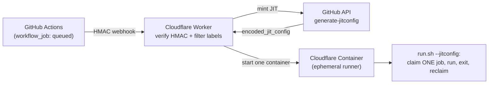

# flare-runner

**Ephemeral GitHub Actions runners on Cloudflare Containers.** A GitHub
`workflow_job:queued` webhook spins up a short-lived Cloudflare Container that
runs **one** job in just-in-time (JIT) mode and exits. No standing VM,
scale-to-zero, per-second billing, one container = one job.



Three moving parts: a **Worker** (`src/index.ts`), a **Container Durable Object**
(`RunnerContainer`), and a **runner image** (`Dockerfile`). Deploy one instance
per GitHub org.

## Why

A persistent self-hosted runner is a single host that serializes jobs, reuses its
workspace between runs, and sits there holding credentials. flare-runner makes
each job a fresh, isolated, throwaway container instead.

## No Docker-in-Docker

Cloudflare Containers can't nest Docker. For most CI - `pnpm`/`go test`/`pytest`,
and `wrangler deploy` of Workers - that's irrelevant; no job step needs a Docker
daemon. A job that must **build a container image** uses [buildah] or [kaniko]
(rootless, daemonless) in place of `docker build`, or stays on a Docker-capable
runner. See `setup.md` → "Building images without Docker".

[buildah]: https://buildah.io
[kaniko]: https://github.com/GoogleContainerTools/kaniko

## Quick start

```bash
npm install
npm test            # unit tests (HMAC + JIT request shaping)
cp .dev.vars.template .dev.vars   # fill GITHUB_TOKEN + WEBHOOK_SECRET
```

Then follow **[setup.md](setup.md)** for the one-time GitHub + Cloudflare wiring
(scope, PAT, webhook, secrets, deploy) and how to point a repo at it with
`runs-on: [self-hosted, cloudflare]`.

## Scopes

Set exactly one in `wrangler.jsonc`:

- `GITHUB_REPO = "owner/repo"` - repo-scoped runners (works for **user repos**).
- `GITHUB_ORG = "your-org"` - org-scoped runners (needs org admin).

This repo deploys **itself** as its own demo, so it ships with `GITHUB_REPO`.

## Workflows

GitHub-hosted (native runners):

- [`ci`](../../actions/workflows/ci.yml) - tests + typecheck on every push/PR.
- [`runner-version`](../../actions/workflows/runner-version.yml) - weekly; bumps the runner pin in the `Dockerfile` via PR.
- [`build-push`](../../actions/workflows/build-push.yml) - builds the runner image and pushes it to
  `ghcr.io/<owner>/flare-runner` (public distribution; Cloudflare builds the same
  Dockerfile to its own registry on deploy).
- [`deploy`](../../actions/workflows/deploy.yml) - manual; `wrangler deploy` (Worker + container) and syncs worker secrets.

On the flare-runner Cloudflare Container itself:

- [`demo`](../../actions/workflows/demo.yml) - the proof: runs a tiny Python API and builds an image with **buildah**
  (no Docker daemon), then pushes it to GHCR.

## Cost note

Cloudflare bills memory + disk for the whole time an instance runs (vCPU is
compute-time). A JIT runner exits after one job, so it only bills for the job's
duration. Watch for leaks with `wrangler containers list`.

## License

MIT - see [LICENSE](LICENSE).
