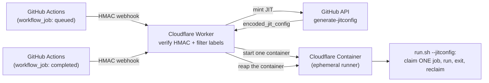

# flare-runner

**Ephemeral GitHub Actions runners on Cloudflare Containers.** A GitHub
`workflow_job:queued` webhook spins up a short-lived Cloudflare Container that
runs **one** job in just-in-time (JIT) mode and exits. No standing VM,
scale-to-zero, per-second billing, one container = one job.


```mermaid
flowchart LR
    A["GitHub Actions<br/>(workflow_job: queued)"]
    B["Cloudflare Worker<br/>verify HMAC + filter labels"]
    C["GitHub API<br/>generate-jitconfig"]
    D["Cloudflare Container<br/>(ephemeral runner)"]
    E["run.sh --jitconfig:<br/>claim ONE job, run, exit, reclaim"]
    F["GitHub Actions<br/>(workflow_job: completed)"]
    A -- "HMAC webhook" --> B
    B -- "mint JIT" --> C
    C -- "encoded_jit_config" --> B
    B -- "start one container" --> D
    D --> E
    F -- "HMAC webhook" --> B
    B -- "reap the container" --> D
```

Three moving parts: a **Worker** (`src/index.ts`), a **Container Durable Object**
(`RunnerContainer`), and a **runner image** (`Dockerfile`). Deploy one instance
per GitHub org.

## Why

A persistent self-hosted runner is a single host that serializes jobs, reuses its
workspace between runs, and sits there holding credentials. flare-runner makes
each job a fresh, isolated, throwaway container instead.

## No Docker-in-Docker

Cloudflare Containers can't nest Docker. For most CI - `pnpm`/`go test`/`pytest`,
and `wrangler deploy` of Workers - that's irrelevant; no job step needs a Docker
daemon. A job that must **build a container image** uses [buildah] or [kaniko]
(rootless, daemonless) in place of `docker build`, or stays on a Docker-capable
runner. See `setup.md` → "Building images without Docker".

[buildah]: https://buildah.io
[kaniko]: https://github.com/GoogleContainerTools/kaniko

## Quick start

```bash
npm install
npm test            # unit tests (HMAC + JIT request shaping)
cp .dev.vars.template .dev.vars   # fill GITHUB_TOKEN + WEBHOOK_SECRET
```

Then follow **[setup.md](setup.md)** for the one-time GitHub + Cloudflare wiring
(scope, PAT, webhook, secrets, deploy) and how to point a repo at it with
`runs-on: [self-hosted, cloudflare]`.

## Scopes

Set exactly one in `wrangler.jsonc`:

- `GITHUB_REPO = "owner/repo"` - repo-scoped runners (works for **user repos**).
- `GITHUB_ORG = "your-org"` - org-scoped runners (needs org admin).

This repo deploys **itself** as its own demo, so it ships with `GITHUB_REPO`.

## Workflows

GitHub-hosted (native runners):

- [`ci`](../../actions/workflows/ci.yml) - tests + typecheck on every push/PR.
- [`runner-version`](../../actions/workflows/runner-version.yml) - weekly; bumps the runner pin in the `Dockerfile` via PR.
- [`build-push`](../../actions/workflows/build-push.yml) - builds the runner image and pushes it to
  `ghcr.io/<owner>/flare-runner` (public distribution; Cloudflare builds the same
  Dockerfile to its own registry on deploy).
- [`deploy`](../../actions/workflows/deploy.yml) - manual; `wrangler deploy` (Worker + container) and syncs worker secrets.

On the flare-runner Cloudflare Container itself:

- [`demo`](../../actions/workflows/demo.yml) - the proof: runs a tiny Python API and builds an image with **buildah**
  (no Docker daemon), then pushes it to GHCR.

## Cost note

Cloudflare bills memory + disk for the whole time an instance runs (vCPU is
compute-time). A JIT runner that claims a job exits when the job ends, so it
bills for the job's duration.

A JIT runner that is **never assigned a job** does not exit. GitHub sends one
`workflow_job:queued` per job, flare-runner starts one container per event, and
if the job is cancelled or another runner claims it first, this runner keeps
long-polling. Nothing about that is visible in the job list, and the container
bills memory the entire time.

Two guards, because a single one has failed in production:

- **`shouldReap`** (`src/webhook.ts`) - `workflow_job:completed` tears the
  container down as soon as GitHub says the job is over, whatever its
  conclusion. This is the precise path; subscribe to Workflow job events and it
  works with no extra configuration.
- **`sleepAfter`** (`src/index.ts`) - a hard wall-clock cap on the container.
  Nothing is ever proxied to a runner, so the SDK's activity timer only ticks at
  start: this is a total-runtime ceiling, **not** an idle timeout. It must stay
  above the longest job you expect (GitHub caps a job at 6h).

Both ultimately depend on the container honouring SIGTERM. Cloudflare signals
PID 1 and **never escalates to SIGKILL**, so `entrypoint.sh` runs the agent as a
child, forwards the signal, and escalates itself. Do not turn that back into
`exec ./run.sh` - bash will not forward SIGTERM to a foreground child, and the
container becomes unkillable.

Watch for leaks with `wrangler containers list`. To audit spend, group
`containersUsageAdaptiveGroups` by `instanceId` in the GraphQL analytics API:
`allocatedMemory` (byte-seconds) divided by the instance's memory gives each
container's wall-clock lifetime, which makes a stuck runner obvious.

### Sizing the instance

Memory and disk are billed on what you **provision**, for the container's whole
wall-clock life. vCPU is billed on what you actually **burn**. Two consequences:

- **Trim memory, never vCPU.** Halving vCPU does not halve the CPU bill, because
  the work does not shrink; it just takes twice as long, and the memory bill is
  charged for that whole doubled time.
- **The half-vCPU predefined types are a trap for CI.** Measured here, Actions
  jobs run at 90-95% of one vCPU. On `standard-1` (1/2 vCPU, 4 GiB) wall-clock
  roughly doubles, so `4 GiB x 2T` beats `6 GiB x T` and the bill goes *up*
  around 15% while CI gets twice as slow.

Hence the default is a custom instance type: a full vCPU with the memory cut to
what a job actually needs.

```jsonc
"instance_type": { "vcpu": 1, "memory_mib": 4096, "disk_mb": 8000 }
```

Custom types require `vcpu >= 1` and are capped by `standard-4` (4 vCPU, 12 GiB,
20 GB). The runner image is ~1.34 GB, so 8 GB of disk leaves roughly 6.6 GB for
the checkout, package store, and any images your jobs build. Raise `disk_mb` if
your jobs build large container images, and `memory_mib` if they OOM.

### Go and node classes

Each wrangler config declares two container classes, `RunnerContainerGo` and
`RunnerContainerNode`, bound to `RUNNER_GO` and `RUNNER_NODE`. A job labelled
`[self-hosted, cloudflare, node]` runs on the node class; `[..., go]` or a bare
`[self-hosted, cloudflare]` (no discriminator) runs on the go class. The go
class is the default, so size it for your heaviest job.

Both classes run the same image and differ only in `instance_type` - nothing
else about them diverges. The spawned runner advertises the discriminator label
back to GitHub alongside the base labels, because GitHub only assigns a job to
a runner whose labels are a superset of the job's `runs-on`; without that, a
`node`-labelled job would never match a runner that only claims
`self-hosted,cloudflare`.

## License

MIT - see [LICENSE](LICENSE).
